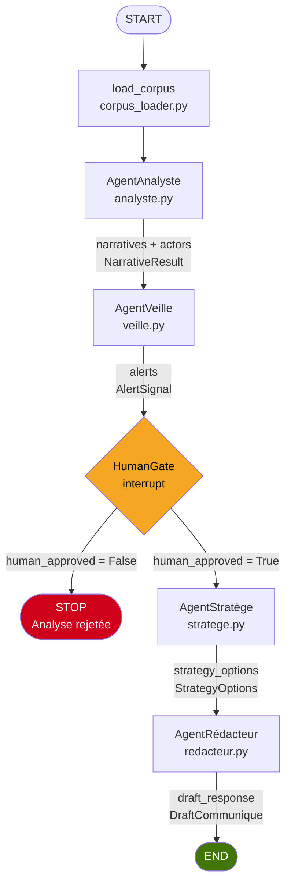

# Architecture Spine — Datathon CNC×Ultia

## Design Paradigm

**Pipes-and-Filters / Stateful Multi-Agent**

Un `StateGraph` LangGraph unique orchestre des agents-filtres séquentiels. Chaque nœud consomme des champs de `CrisisState` et en produit de nouveaux — sans communication latérale.

| Répertoire | Rôle dans le paradigme |
|---|---|
| `/pipeline/state.py` | Définition de `CrisisState` (TypedDict) |
| `/pipeline/graph.py` | Assemblage du StateGraph, routage conditionnel |
| `/agents/` | Nœuds-filtres (analyste, veille, stratege, redacteur) |
| `/tools/corpus_loader.py` | Outil d'entrée unique → DataFrame nettoyé |
| `/prompts/prompts.py` | System prompt de neutralité partagé |
| `/outputs/` | Artefacts finaux (JSON Pydantic, communicués drafts) |

---

## Invariants & Rules

**AD-1 | PARADIGME**
- **Binds :** tout agent est un nœud dans le même `StateGraph` ; le graphe est la seule entité qui connaît l'ordre d'exécution.
- **Prevents :** appels directs agent-à-agent hors du graphe ; duplication de l'état.
- **Règle :** aucun agent n'importe un autre agent directement.

**AD-2 | ÉTAT PARTAGÉ**
- **Binds :** un seul `TypedDict CrisisState` transmis entre tous les nœuds. Champs : `raw_df`, `tweets_sample`, `narratives`, `actors`, `alerts`, `strategy_options`, `draft_response`, `human_approved`. Chaque agent lit et écrit uniquement dans ses champs déclarés.
- **Prevents :** variables globales ou effets de bord inter-agents.
- **Règle :** tout champ non déclaré dans `CrisisState` est interdit.

**AD-3 | ACCÈS DONNÉES**
- **Binds :** une seule fonction `load_corpus(path) → DataFrame` centralise lecture et nettoyage (types, doublons, NaN). Les agents reçoivent des slices pandas (filter + sample).
- **Prevents :** lecture ou nettoyage redondant dans les agents.
- **Règle :** les agents ne lisent jamais `data.xlsx` directement.

**AD-4 | OUTPUTS TYPÉS**
- **Binds :** chaque agent produit un objet Pydantic (`NarrativeResult`, `AlertSignal`, `StrategyOptions`, `DraftCommunique`). Le schéma Pydantic est le contrat d'interface.
- **Prevents :** interprétation divergente d'un output textuel libre.
- **Règle :** aucun agent ne retourne une chaîne brute comme output fonctionnel.

**AD-5 | NEUTRALITÉ**
- **Binds :** `prompts.py` centralise le system prompt de neutralité (ton factuel, décrire sans juger), importé par tous les agents.
- **Prevents :** agent qui définirait son propre system prompt sans passer par ce module.
- **Règle :** aucun agent ne hardcode de `system_prompt` en dehors de `prompts.py`.

**AD-6 | HUMAN GATE**
- **Binds :** un nœud `HumanGate` (interrupt LangGraph) s'intercale entre `AgentVeille` et `AgentStratège`. L'orchestrateur suspend, présente l'analyse, attend confirmation, puis reprend.
- **Prevents :** génération de réponses institutionnelles sur analyse hallucinée.
- **Règle :** `AgentStratège` ne s'exécute jamais si `human_approved is False`.

**AD-7 | LLM PROVIDER**
- **Binds :** `ChatGoogleGenerativeAI` (Gemini 2.0 Flash) instancié via `get_llm()`, clé lue depuis `GOOGLE_API_KEY` (variable d'environnement Colab Secrets).
- **Prevents :** provider hardcodé dans un agent ; clé API en clair dans le code.
- **Règle :** tout appel LLM passe par `get_llm()` défini dans `/tools/llm_factory.py`.

**AD-8 | SÉQUENCE PIPELINE**
- **Binds :** `Analyste → Veille → [HumanGate] → Stratège → Rédacteur`. Exécution séquentielle (pas de parallélisme J1-J2).
- **Prevents :** `AgentVeille` tournant sans les narratifs de l'Analyste ; `AgentStratège` répondant sans les alertes de la Veille.
- **Règle :** l'ordre des nœuds dans `graph.py` reflète exactement cette séquence.

**AD-9 | GÉNÉRALISATION**
- **Binds :** les agents reçoivent un `corpus_config: dict` (événement, période, mots-clés déclencheurs) injecté à l'init du graph.
- **Prevents :** références hardcodées à 'Ultia', 'CNC', ou 'mars 2026' dans le code agent.
- **Règle :** grep `"Ultia\|CNC\|mars 2026"` dans `/agents/` doit retourner zéro résultat.

**AD-10 | ANTI-HALLUCINATION**
- **Binds :** tout objet Pydantic inclut un champ `source_tweet_ids: list[str]` obligatoire (non-nullable). Le Rédacteur ne reformule que des claims avec ce champ renseigné.
- **Prevents :** affirmations inventées non traçables dans le rapport final.
- **Règle :** `source_tweet_ids = []` déclenche une `ValueError` à la validation Pydantic.

---

## Consistency Conventions

| Domaine | Convention |
|---|---|
| Nommage fichiers | `snake_case` pour tous les modules Python |
| Nommage classes | `PascalCase` pour agents et schémas Pydantic |
| Nommage champs état | `snake_case` dans `CrisisState` |
| Format dates | ISO 8601 (`YYYY-MM-DD`) — colonne `Date` du corpus |
| IDs tweets | Conserver comme `str` (postID) — ne pas caster en int |
| Mutation d'état | Retourner un dict partiel `{champ: valeur}` — LangGraph merge automatiquement |
| Neutralité éditoriale | Décrire avant de juger ; ton factuel dans tous les outputs LLM |
| Langue code | Anglais pour le code et les identifiants ; français pour les docstrings et prompts |

---

## Stack

| Composant | Version minimale | Notes |
|---|---|---|
| Python | 3.10 | Google Colab 2026 default |
| langchain | 0.3 | `pip install langchain` |
| langgraph | 0.2 | `pip install langgraph` |
| pandas | 2.0 | Lecture `.xlsx` via openpyxl |
| openpyxl | 3.1 | Backend Excel pour pandas |
| pydantic | 2.x | Fourni avec langchain 0.3 |
| langchain-google-genai | latest | `ChatGoogleGenerativeAI` |
| LLM | Gemini 2.0 Flash | Google AI Studio — quota Free ~1500 req/min |

---

## Structural Seed

### Arborescence

```
datathon-cnc-ultia/
├── data/
│   ├── data.xlsx                  # Corpus brut (ne pas modifier)
│   └── dictionnaire_bdd.md        # Documentation des 30 colonnes
├── agents/
│   ├── analyste.py                # Nœud 1 — narratifs + acteurs
│   ├── veille.py                  # Nœud 2 — alertes + seuils
│   ├── stratege.py                # Nœud 4 — options stratégiques
│   └── redacteur.py               # Nœud 5 — communicé draft
├── tools/
│   ├── corpus_loader.py           # load_corpus(path) → DataFrame
│   └── llm_factory.py             # get_llm() → ChatGoogleGenerativeAI
├── prompts/
│   └── prompts.py                 # SYSTEM_PROMPT_NEUTRAL + templates
├── pipeline/
│   ├── state.py                   # CrisisState TypedDict
│   └── graph.py                   # StateGraph — assemblage + routage
├── schemas/
│   ├── narrative_result.py        # Pydantic: NarrativeResult
│   ├── alert_signal.py            # Pydantic: AlertSignal
│   ├── strategy_options.py        # Pydantic: StrategyOptions
│   └── draft_communique.py        # Pydantic: DraftCommunique
├── notebooks/
│   └── J1_exploration.ipynb       # Exploration pandas J1
├── outputs/                       # Artefacts générés (gitignored sauf exemples)
├── requirements.txt
└── README.md
```

### Flux LangGraph



### CrisisState — champs et propriétaires

```
CrisisState (TypedDict)
├── raw_df: pd.DataFrame          # corpus_loader → lecture seule partout
├── tweets_sample: pd.DataFrame   # analyste → lecture dans veille
├── corpus_config: dict           # injecté à l'init — lecture seule
├── narratives: NarrativeResult   # analyste → écrit
├── actors: list[dict]            # analyste → écrit
├── alerts: AlertSignal           # veille → écrit
├── human_approved: bool          # HumanGate → écrit
├── strategy_options: StrategyOptions  # stratege → écrit
└── draft_response: DraftCommunique   # redacteur → écrit
```

---

## Deferred

Les décisions suivantes sont laissées à chaque développeur — elles n'affectent pas les invariants ci-dessus.

| Décision | Responsable | Deadline |
|---|---|---|
| Seuils d'alerte viraux (engagement, impressions, vélocité) | P4 (AgentVeille) | J2 matin |
| Nombre de tweets dans `tweets_sample` (full vs. échantillon) | P2 + P3 | J1 après exploration |
| Format du `corpus_config` pour démo (hardcodé vs. formulaire Colab) | P5 | J2 fin |
| Axes du communicé (quantité d'options dans `StrategyOptions`) | P5 + P6 | J2 |
| Template de slides démo (structure, visuels) | P6 | J2-J3 |
| Stratégie de batching si >50k lignes (chunking pandas) | P1 + P3 | J1 si nécessaire |
| Clé API effective (Gemini confirmé ou fallback Groq/Mistral) | P5 | J1 avant 10h |
