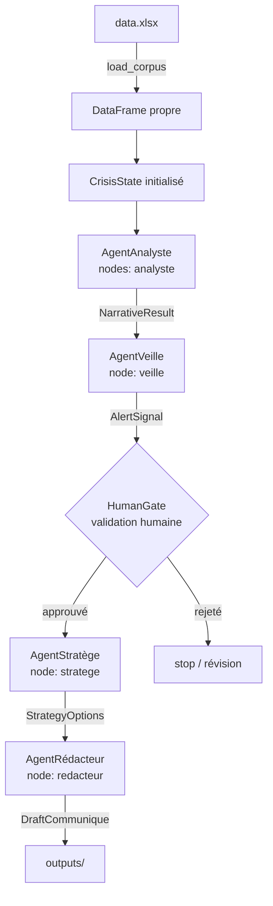

# Architecture Projet — Datathon NEXA Digital School
## Affaire Ultia × CNC (mars-avril 2026) — Système multi-agents d'analyse de crise virale

> **Document à partager avec toute l'équipe avant J1.**
> Ce fichier est le contrat technique de référence : il fixe ce que chacun construit, comment les modules se parlent, et les règles à ne jamais enfreindre.

---

## Table des matières

1. [Contexte et mission](#1-contexte-et-mission)
2. [Architecture globale](#2-architecture-globale)
3. [Contrat de données — Schéma corpus](#3-contrat-de-données--schéma-corpus)
4. [CrisisState — l'état partagé](#4-crisisstate--létat-partagé)
5. [Les agents — spécifications](#5-les-agents--spécifications)
   - 5.1 [load_corpus() — Outil de chargement](#51-load_corpus--outil-de-chargement)
   - 5.2 [Agent Analyste](#52-agent-analyste)
   - 5.3 [Agent Veille](#53-agent-veille)
   - 5.4 [HumanGate — Validation humaine](#54-humangate--validation-humaine)
   - 5.5 [Agent Stratège](#55-agent-stratège)
   - 5.6 [Agent Rédacteur](#56-agent-rédacteur)
6. [Conventions obligatoires (AD-1 à AD-10)](#6-conventions-obligatoires-ad-1-à-ad-10)
7. [Structure du repo](#7-structure-du-repo)
8. [Plan J1 / J2 / J3 par personne](#8-plan-j1--j2--j3-par-personne)
9. [Setup initial](#9-setup-initial)

---

## 1. Contexte et mission

Le datathon porte sur la crise virale déclenchée sur X (ex-Twitter) entre mars et avril 2026, opposant la plateforme **Ultia** au **CNC** (Centre National du Cinéma). Le corpus fourni (`data.xlsx`, ~30 colonnes) capture la propagation de cette tempête : tweets originaux, retweets, quotes, commentaires, avec leurs métadonnées d'engagement et de réseau. Notre mission se déroule en trois actes sur trois jours : **comprendre** la dynamique de la crise (J1), **construire** des agents IA capables de l'analyser automatiquement (J2), et **orchestrer** un pipeline complet qui va de la détection à la rédaction d'une réponse institutionnelle (J3). Le livrable final est une démo live devant jury + un pitch de 10 minutes.

---

## 2. Architecture globale

### Vue d'ensemble du pipeline

```
┌─────────────────────────────────────────────────────────────────────────┐
│                         data/data.xlsx                                  │
└─────────────────────────────┬───────────────────────────────────────────┘
                              │
                    tools/corpus_loader.py
                    load_corpus(path) → DataFrame
                              │
                    ┌─────────▼──────────┐
                    │   CrisisState      │  ← pipeline/state.py
                    │   (TypedDict)      │     état partagé entre tous les nœuds
                    └─────────┬──────────┘
                              │
              ┌───────────────▼────────────────────┐
              │      LangGraph StateGraph           │  ← pipeline/graph.py
              │                                    │
              │  ┌──────────────────────────────┐  │
              │  │  Nœud 1 : AgentAnalyste      │  │  → NarrativeResult
              │  │  (narratif + acteur/tweet)   │  │    (narratif_dominant, analyses[])
              │  └──────────────┬───────────────┘  │
              │                 │                  │
              │  ┌──────────────▼───────────────┐  │
              │  │  Nœud 2 : AgentVeille        │  │  → AlertSignal
              │  │  (seuils + moment pic)       │  │    (is_alert, peaks[], thresholds)
              │  └──────────────┬───────────────┘  │
              │                 │                  │
              │  ┌──────────────▼───────────────┐  │
              │  │  HumanGate (interrupt)        │  │  ← PAUSE OBLIGATOIRE
              │  │  validation manuelle équipe  │  │    humain valide avant de continuer
              │  └──────────────┬───────────────┘  │
              │                 │  human_approved=True
              │  ┌──────────────▼───────────────┐  │
              │  │  Nœud 3 : AgentStratège      │  │  → StrategyOptions
              │  │  (options de réponse)        │  │    (options[], risques[])
              │  └──────────────┬───────────────┘  │
              │                 │                  │
              │  ┌──────────────▼───────────────┐  │
              │  │  Nœud 4 : AgentRédacteur     │  │  → DraftCommunique
              │  │  (3 tonalités de draft)      │  │    (prudent/équilibré/assertif)
              │  └──────────────────────────────┘  │
              └────────────────────────────────────┘
                              │
                    outputs/  (JSON + drafts)
```

### Diagramme Mermaid (pour slides)



---

## 3. Contrat de données — Schéma corpus

Le fichier `data/data.xlsx` contient les colonnes suivantes (référence : `dictionnaire_bdd.xlsx`). Seules les colonnes clés sont listées — la fonction `load_corpus()` est responsable des types et du nettoyage.

| Colonne              | Type après nettoyage | Description                                              | Utilisé par         |
|----------------------|----------------------|----------------------------------------------------------|---------------------|
| `Date`               | `datetime`           | Horodatage (YYYY-MM-DD HH:MM:SS)                        | Veille, DA-P1       |
| `postID`             | `str`                | Identifiant unique du tweet — sert de `source_tweet_ids` | TOUS les agents     |
| `Author`             | `str`                | Handle X de l'auteur (`@username`)                      | Analyste, DA-P2     |
| `X Author ID`        | `str`                | ID numérique de l'auteur                                | DA-P2               |
| `Full Text`          | `str`                | Texte brut du tweet                                     | Analyste            |
| `message_normalizer` | `str`                | Texte nettoyé (minuscules, sans URLs)                   | Analyste (priorité) |
| `Sentiment`          | `str`                | `positive` / `negative` / `neutral`                     | Veille              |
| `Language`           | `str`                | Code ISO langue (`fr`, `en`, …)                         | Filtre corpus       |
| `Country`            | `str`                | Pays de l'auteur (peut être vide)                       | DA-P2               |
| `Likes`              | `int`                | Nombre de likes                                         | Veille (seuil)      |
| `Comments`           | `int`                | Nombre de commentaires                                  | Veille (seuil)      |
| `Shares`             | `int`                | Nombre de partages/retweets                             | Veille (seuil)      |
| `Impressions`        | `int`                | Impressions totales                                     | Veille              |
| `Reach`              | `int`                | Portée estimée                                          | Veille              |
| `X Verified`         | `bool`               | Compte certifié X                                       | Analyste (acteur)   |
| `X Followers`        | `int`                | Nombre d'abonnés                                        | Analyste (influence)|
| `X Following`        | `int`                | Nombre d'abonnements                                    | DA-P2               |
| `X Posts`            | `int`                | Total de publications du compte                         | DA-P2               |
| `Engagement Type`    | `str`                | `retweet` / `quote` / `commentaire` / vide=original    | DA-P1, Analyste     |
| `X Reply to`         | `str`                | postID du tweet parent (si réponse)                     | DA-P1               |
| `X Repost of`        | `str`                | postID du tweet source (si retweet)                     | DA-P1               |
| `Mentioned Authors`  | `str`                | Handles mentionnés (séparés par virgule)                | DA-P2               |
| `Hashtags`           | `str`                | Hashtags utilisés                                       | Veille, DA-P2       |
| `Expanded URLs`      | `str`                | URLs développées dans le tweet                          | Analyste            |

> **Règle** : aucun agent ne lit `data.xlsx` directement. Tout passe par `load_corpus()`.

---

## 4. CrisisState — l'état partagé

Ce TypedDict est **le seul vecteur d'information entre les nœuds**. Chaque agent lit ses inputs dans ce dict et écrit ses outputs dans ses propres champs. Aucune variable globale, aucun effet de bord.

```python
# pipeline/state.py
from __future__ import annotations
from typing import TypedDict, Optional, Any
import pandas as pd

class CrisisState(TypedDict):
    # --- Données brutes ---
    raw_df: pd.DataFrame             # DataFrame complet chargé par load_corpus()
    tweets_sample: pd.DataFrame      # Sous-ensemble sélectionné pour les agents LLM
    corpus_config: dict              # {"evenement": "...", "periode": "...", "mots_cles": [...]}

    # --- Outputs Analyste ---
    narratives: Optional[dict]       # NarrativeResult sérialisé (dict JSON-compatible)

    # --- Outputs Veille ---
    alerts: Optional[dict]           # AlertSignal sérialisé

    # --- Validation humaine ---
    human_approved: bool             # False par défaut, True après HumanGate

    # --- Outputs Stratège ---
    strategy_options: Optional[dict] # StrategyOptions sérialisé

    # --- Outputs Rédacteur ---
    draft_response: Optional[dict]   # DraftCommunique sérialisé

    # --- Métadonnées pipeline ---
    run_id: str                      # UUID de la session (pour les outputs/)
    errors: list[str]               # Log des erreurs non-fatales
```

**Initialisation du state dans `pipeline/graph.py` :**

```python
import uuid
import pandas as pd
from pipeline.state import CrisisState

def init_state(df: pd.DataFrame, corpus_config: dict) -> CrisisState:
    return CrisisState(
        raw_df=df,
        tweets_sample=df.sample(min(500, len(df)), random_state=42),
        corpus_config=corpus_config,
        narratives=None,
        alerts=None,
        human_approved=False,
        strategy_options=None,
        draft_response=None,
        run_id=str(uuid.uuid4())[:8],
        errors=[],
    )
```

---

## 5. Les agents — spécifications

### 5.1 `load_corpus()` — Outil de chargement

**Responsable** : P5 (J1)
**Fichier** : `tools/corpus_loader.py`

```python
# tools/corpus_loader.py
import pandas as pd

def load_corpus(path: str = "data/data.xlsx") -> pd.DataFrame:
    """
    Charge et nettoie le corpus data.xlsx.
    Centralise TOUTE la logique de nettoyage — les agents reçoivent un DataFrame propre.
    """
    df = pd.read_excel(path, engine="openpyxl")

    # Types
    df["Date"] = pd.to_datetime(df["Date"], errors="coerce")
    df["postID"] = df["postID"].astype(str)
    df["X Author ID"] = df["X Author ID"].astype(str)
    df["X Verified"] = df["X Verified"].fillna(False).astype(bool)

    # Colonnes numériques
    for col in ["Likes", "Comments", "Shares", "Impressions", "Reach",
                "X Followers", "X Following", "X Posts"]:
        df[col] = pd.to_numeric(df[col], errors="coerce").fillna(0).astype(int)

    # Texte
    df["Full Text"] = df["Full Text"].fillna("").astype(str)
    df["message_normalizer"] = df["message_normalizer"].fillna("").astype(str)
    df["Hashtags"] = df["Hashtags"].fillna("").astype(str)
    df["Engagement Type"] = df["Engagement Type"].fillna("original").astype(str)

    # Doublons
    df = df.drop_duplicates(subset=["postID"])
    df = df.sort_values("Date").reset_index(drop=True)

    print(f"[load_corpus] {len(df)} tweets chargés — {df['Date'].min()} → {df['Date'].max()}")
    return df
```

---

### 5.2 Agent Analyste

**Responsable** : P3 (J2)
**Fichier** : `agents/analyste.py`
**Rôle** : Classifier chaque tweet selon son narratif dominant et le type d'acteur.

#### Inputs depuis CrisisState
- `state["tweets_sample"]` — DataFrame (colonnes : `postID`, `message_normalizer`, `Author`, `X Verified`, `X Followers`, `Engagement Type`)
- `state["corpus_config"]` — contexte événement

#### Output Pydantic

```python
class TweetAnalysis(BaseModel):
    tweet_id: str
    narratif: str   # "censure" | "copinage" | "defense_ultia" | "defense_cnc" | "autre"
    acteur_type: str  # "media" | "militant" | "influenceur" | "anonyme" | "institution"
    source_tweet_ids: list[str]

class NarrativeResult(BaseModel):
    analyses: list[TweetAnalysis]
    narratif_dominant: str
    repartition: dict[str, int]   # {"censure": 42, "copinage": 18, ...}
    source_tweet_ids: list[str]   # tous les postID analysés
```

#### Exemple de sortie JSON (`outputs/narratives_<run_id>.json`)

```json
{
  "narratif_dominant": "censure",
  "repartition": {
    "censure": 312,
    "copinage": 87,
    "defense_ultia": 45,
    "defense_cnc": 12,
    "autre": 44
  },
  "analyses": [
    {
      "tweet_id": "1905234567890",
      "narratif": "censure",
      "acteur_type": "militant",
      "source_tweet_ids": ["1905234567890"]
    }
  ],
  "source_tweet_ids": ["1905234567890", "1905234567891", "..."]
}
```

#### Code stub

```python
# agents/analyste.py
from __future__ import annotations
import json
import pandas as pd
from langchain_google_genai import ChatGoogleGenerativeAI
from langchain_core.output_parsers import PydanticOutputParser
from langchain_core.prompts import ChatPromptTemplate
from pydantic import BaseModel, Field
from prompts.prompts import get_system_prompt, get_llm
from pipeline.state import CrisisState


class TweetAnalysis(BaseModel):
    tweet_id: str = Field(description="postID du tweet analysé")
    narratif: str = Field(description="censure | copinage | defense_ultia | defense_cnc | autre")
    acteur_type: str = Field(description="media | militant | influenceur | anonyme | institution")
    source_tweet_ids: list[str] = Field(description="Liste des postID cités comme sources")


class NarrativeResult(BaseModel):
    analyses: list[TweetAnalysis]
    narratif_dominant: str = Field(description="Le narratif le plus fréquent")
    repartition: dict = Field(description="Comptage par catégorie de narratif")
    source_tweet_ids: list[str] = Field(description="Tous les postID analysés")


def run_analyste(state: CrisisState) -> CrisisState:
    df: pd.DataFrame = state["tweets_sample"]
    config: dict = state["corpus_config"]

    # Sélection des colonnes pertinentes et formatage en texte
    cols = ["postID", "message_normalizer", "Author", "X Verified", "X Followers", "Engagement Type"]
    sample = df[cols].head(200)  # batch de 200 tweets pour le LLM

    tweets_text = "\n".join(
        f"[{row.postID}] @{row.Author} (followers:{row['X Followers']}, verified:{row['X Verified']}, type:{row['Engagement Type']})\n{row.message_normalizer}"
        for _, row in sample.iterrows()
    )

    parser = PydanticOutputParser(pydantic_object=NarrativeResult)
    llm = get_llm()

    prompt = ChatPromptTemplate.from_messages([
        ("system", get_system_prompt("analyste")),
        ("human", (
            "Contexte événement : {evenement} — Période : {periode}\n\n"
            "Voici un échantillon de tweets à classifier :\n\n{tweets}\n\n"
            "Pour chaque tweet, identifie le narratif et le type d'acteur.\n"
            "{format_instructions}"
        )),
    ])

    chain = prompt | llm | parser

    result: NarrativeResult = chain.invoke({
        "evenement": config.get("evenement", "crise virale"),
        "periode": config.get("periode", ""),
        "tweets": tweets_text,
        "format_instructions": parser.get_format_instructions(),
    })

    # Calcul repartition si non rempli par le LLM
    if not result.repartition:
        from collections import Counter
        result.repartition = dict(Counter(a.narratif for a in result.analyses))

    state["narratives"] = result.model_dump()
    return state
```

---

### 5.3 Agent Veille

**Responsable** : P4 (J2)
**Fichier** : `agents/veille.py`
**Rôle** : Détecter les pics d'engagement, les moments de bascule, et générer des alertes si des seuils sont dépassés.

#### Inputs depuis CrisisState
- `state["raw_df"]` — DataFrame complet (pour l'analyse temporelle)
- `state["narratives"]` — NarrativeResult (pour contextualiser les pics)
- `state["corpus_config"]`

#### Output Pydantic

```python
class PeakEvent(BaseModel):
    timestamp: str          # ISO format
    metric: str             # "Likes" | "Shares" | "Impressions" | "Comments"
    value: int
    tweet_ids_at_peak: list[str]
    source_tweet_ids: list[str]

class AlertSignal(BaseModel):
    is_alert: bool
    alert_level: str        # "low" | "medium" | "high" | "critical"
    peaks: list[PeakEvent]
    threshold_breaches: dict[str, int]   # {"Likes": 1500, "Shares": 800}
    summary: str
    source_tweet_ids: list[str]
```

#### Exemple de sortie JSON (`outputs/alerts_<run_id>.json`)

```json
{
  "is_alert": true,
  "alert_level": "high",
  "peaks": [
    {
      "timestamp": "2026-03-29T14:32:00",
      "metric": "Shares",
      "value": 2847,
      "tweet_ids_at_peak": ["1905567890123", "1905567890124"],
      "source_tweet_ids": ["1905567890123", "1905567890124"]
    }
  ],
  "threshold_breaches": {
    "Shares": 2847,
    "Impressions": 450000
  },
  "summary": "Pic critique détecté le 29 mars à 14h32 — 2847 partages en 1 heure.",
  "source_tweet_ids": ["1905567890123", "1905567890124", "..."]
}
```

#### Code stub

```python
# agents/veille.py
from __future__ import annotations
import pandas as pd
from langchain_core.output_parsers import PydanticOutputParser
from langchain_core.prompts import ChatPromptTemplate
from pydantic import BaseModel, Field
from prompts.prompts import get_system_prompt, get_llm
from pipeline.state import CrisisState


class PeakEvent(BaseModel):
    timestamp: str
    metric: str
    value: int
    tweet_ids_at_peak: list[str]
    source_tweet_ids: list[str]


class AlertSignal(BaseModel):
    is_alert: bool
    alert_level: str = Field(description="low | medium | high | critical")
    peaks: list[PeakEvent]
    threshold_breaches: dict = Field(description="Métriques et valeurs ayant dépassé les seuils")
    summary: str
    source_tweet_ids: list[str]


# Seuils configurables — à calibrer J2 selon le corpus réel
THRESHOLDS = {
    "Likes": 500,
    "Shares": 300,
    "Comments": 200,
    "Impressions": 100_000,
}


def run_veille(state: CrisisState) -> CrisisState:
    df: pd.DataFrame = state["raw_df"]

    # Analyse statistique pandas (sans LLM pour les seuils)
    breaches = {
        metric: int(df[metric].max())
        for metric, threshold in THRESHOLDS.items()
        if df[metric].max() > threshold
    }
    is_alert = len(breaches) > 0

    # Résumé temporel pour le LLM
    df["hour"] = df["Date"].dt.floor("h")
    hourly = df.groupby("hour")[["Likes", "Shares", "Impressions"]].sum()
    top_hours = hourly.nlargest(5, "Shares").reset_index()
    temporal_summary = top_hours.to_string()

    # Tweets au pic
    peak_hour = hourly["Shares"].idxmax() if not hourly.empty else None
    peak_tweets = (
        df[df["hour"] == peak_hour]["postID"].tolist()
        if peak_hour is not None else []
    )

    parser = PydanticOutputParser(pydantic_object=AlertSignal)
    llm = get_llm()

    prompt = ChatPromptTemplate.from_messages([
        ("system", get_system_prompt("veille")),
        ("human", (
            "Voici les heures de pic d'engagement (top 5) :\n{temporal_summary}\n\n"
            "Seuils dépassés : {breaches}\n"
            "Tweets au pic principal : {peak_tweet_ids}\n\n"
            "Génère un AlertSignal structuré avec une synthèse factuelle.\n"
            "{format_instructions}"
        )),
    ])

    chain = prompt | llm | parser

    result: AlertSignal = chain.invoke({
        "temporal_summary": temporal_summary,
        "breaches": str(breaches),
        "peak_tweet_ids": str(peak_tweets[:10]),
        "format_instructions": parser.get_format_instructions(),
    })

    # Override champs calculés par pandas (plus fiable que le LLM)
    result.is_alert = is_alert
    result.threshold_breaches = breaches

    state["alerts"] = result.model_dump()
    return state
```

---

### 5.4 HumanGate — Validation humaine

**Responsable** : P5 (J2-J3)
**Fichier** : `pipeline/graph.py` (intégré dans le graphe)
**Rôle** : Pause obligatoire entre AgentVeille et AgentStratège. Présente l'analyse à l'équipe, attend une confirmation avant de générer des réponses institutionnelles.

```python
# Dans pipeline/graph.py
from langgraph.types import interrupt

def human_gate(state: CrisisState) -> CrisisState:
    """
    Suspend le pipeline pour validation humaine.
    Affiche l'analyse et les alertes. Reprend uniquement après approbation.
    """
    print("\n" + "="*60)
    print("HUMAN GATE — VALIDATION REQUISE")
    print("="*60)
    print(f"Narratif dominant : {state['narratives']['narratif_dominant']}")
    print(f"Répartition : {state['narratives']['repartition']}")
    print(f"Niveau d'alerte : {state['alerts']['alert_level']}")
    print(f"Résumé : {state['alerts']['summary']}")
    print("="*60)

    # LangGraph interrupt() : suspend le graphe, reprend via graph.update_state()
    human_input = interrupt({
        "message": "Validez-vous l'analyse avant de générer des réponses ? (yes/no)",
        "narratives": state["narratives"],
        "alerts": state["alerts"],
    })

    if str(human_input).strip().lower() in ("yes", "oui", "y", "o"):
        state["human_approved"] = True
    else:
        state["human_approved"] = False

    return state
```

---

### 5.5 Agent Stratège

**Responsable** : P5 (J2-J3)
**Fichier** : `agents/stratege.py`
**Rôle** : À partir des narratifs et alertes validés, proposer des options de réponse avec leurs risques associés.

#### Inputs depuis CrisisState
- `state["narratives"]` — NarrativeResult sérialisé
- `state["alerts"]` — AlertSignal sérialisé
- `state["corpus_config"]`
- `state["human_approved"]` — doit être `True` (vérifié dans le graphe)

#### Output Pydantic

```python
class ResponseOption(BaseModel):
    option_id: str            # "opt_1" | "opt_2" | "opt_3"
    titre: str
    description: str
    tonalite: str             # "prudent" | "equilibre" | "assertif"
    risques: list[str]
    source_tweet_ids: list[str]

class StrategyOptions(BaseModel):
    options: list[ResponseOption]
    option_recommandee: str   # option_id recommandé
    justification: str
    source_tweet_ids: list[str]
```

#### Exemple de sortie JSON (`outputs/strategy_<run_id>.json`)

```json
{
  "options": [
    {
      "option_id": "opt_1",
      "titre": "Communiqué factuel — rappel du cadre légal",
      "description": "Rappeler les missions du CNC et le cadre réglementaire sans entrer dans le débat.",
      "tonalite": "prudent",
      "risques": ["Perçu comme froid", "Peut amplifier la sensation de déni"],
      "source_tweet_ids": ["1905234567890"]
    }
  ],
  "option_recommandee": "opt_2",
  "justification": "Le narratif 'censure' domine (62%) — une réponse équilibrée reconnaît les préoccupations sans valider l'accusation.",
  "source_tweet_ids": ["1905234567890", "1905234567891"]
}
```

#### Code stub

```python
# agents/stratege.py
from __future__ import annotations
from langchain_core.output_parsers import PydanticOutputParser
from langchain_core.prompts import ChatPromptTemplate
from pydantic import BaseModel, Field
from prompts.prompts import get_system_prompt, get_llm
from pipeline.state import CrisisState


class ResponseOption(BaseModel):
    option_id: str
    titre: str
    description: str
    tonalite: str = Field(description="prudent | equilibre | assertif")
    risques: list[str]
    source_tweet_ids: list[str]


class StrategyOptions(BaseModel):
    options: list[ResponseOption]
    option_recommandee: str
    justification: str
    source_tweet_ids: list[str]


def run_stratege(state: CrisisState) -> CrisisState:
    assert state["human_approved"], "HumanGate non validé — AgentStratège bloqué."

    narratives = state["narratives"]
    alerts = state["alerts"]
    config = state["corpus_config"]

    parser = PydanticOutputParser(pydantic_object=StrategyOptions)
    llm = get_llm()

    prompt = ChatPromptTemplate.from_messages([
        ("system", get_system_prompt("stratege")),
        ("human", (
            "Contexte : {evenement}\n\n"
            "Narratif dominant : {narratif_dominant}\n"
            "Répartition des narratifs : {repartition}\n"
            "Niveau d'alerte : {alert_level}\n"
            "Résumé de la crise : {alert_summary}\n\n"
            "Propose 3 options de réponse institutionnelle (prudent / équilibré / assertif) "
            "avec leurs risques. Chaque option doit citer des source_tweet_ids.\n"
            "{format_instructions}"
        )),
    ])

    chain = prompt | llm | parser

    result: StrategyOptions = chain.invoke({
        "evenement": config.get("evenement", ""),
        "narratif_dominant": narratives.get("narratif_dominant", ""),
        "repartition": str(narratives.get("repartition", {})),
        "alert_level": alerts.get("alert_level", ""),
        "alert_summary": alerts.get("summary", ""),
        "format_instructions": parser.get_format_instructions(),
    })

    state["strategy_options"] = result.model_dump()
    return state
```

---

### 5.6 Agent Rédacteur

**Responsable** : P5 (J2-J3)
**Fichier** : `agents/redacteur.py`
**Rôle** : Rédiger 3 versions de communiqué selon les 3 tonalités proposées par le Stratège.

#### Inputs depuis CrisisState
- `state["strategy_options"]` — StrategyOptions sérialisé
- `state["narratives"]`
- `state["corpus_config"]`

#### Output Pydantic

```python
class DraftVersion(BaseModel):
    tonalite: str             # "prudent" | "equilibre" | "assertif"
    titre: str
    corps: str
    call_to_action: str
    source_tweet_ids: list[str]

class DraftCommunique(BaseModel):
    versions: list[DraftVersion]
    recommandation: str       # tonalite recommandée
    source_tweet_ids: list[str]
```

#### Exemple de sortie JSON (`outputs/drafts_<run_id>.json`)

```json
{
  "versions": [
    {
      "tonalite": "prudent",
      "titre": "Le CNC réaffirme son rôle de régulateur indépendant",
      "corps": "Le Centre National du Cinéma et de l'Image Animée tient à rappeler que ses missions s'exercent dans un cadre légal établi par le législateur...",
      "call_to_action": "Pour toute question, notre équipe reste disponible.",
      "source_tweet_ids": ["1905234567890", "1905234567891"]
    }
  ],
  "recommandation": "equilibre",
  "source_tweet_ids": ["1905234567890", "1905234567891"]
}
```

#### Code stub

```python
# agents/redacteur.py
from __future__ import annotations
from langchain_core.output_parsers import PydanticOutputParser
from langchain_core.prompts import ChatPromptTemplate
from pydantic import BaseModel, Field
from prompts.prompts import get_system_prompt, get_llm
from pipeline.state import CrisisState


class DraftVersion(BaseModel):
    tonalite: str = Field(description="prudent | equilibre | assertif")
    titre: str
    corps: str
    call_to_action: str
    source_tweet_ids: list[str]


class DraftCommunique(BaseModel):
    versions: list[DraftVersion]
    recommandation: str = Field(description="Tonalité recommandée parmi les 3 versions")
    source_tweet_ids: list[str]


def run_redacteur(state: CrisisState) -> CrisisState:
    strategy = state["strategy_options"]
    narratives = state["narratives"]
    config = state["corpus_config"]

    options_text = "\n".join(
        f"- [{opt['option_id']} / {opt['tonalite']}] {opt['titre']} : {opt['description']}"
        for opt in strategy.get("options", [])
    )

    parser = PydanticOutputParser(pydantic_object=DraftCommunique)
    llm = get_llm()

    prompt = ChatPromptTemplate.from_messages([
        ("system", get_system_prompt("redacteur")),
        ("human", (
            "Contexte : {evenement}\n"
            "Narratif dominant à adresser : {narratif_dominant}\n\n"
            "Options stratégiques validées :\n{options}\n\n"
            "Rédige 3 versions de communiqué (prudent, équilibré, assertif). "
            "Chaque version doit être factuelle, citer les source_tweet_ids, "
            "et ne pas prendre position politique.\n"
            "{format_instructions}"
        )),
    ])

    chain = prompt | llm | parser

    result: DraftCommunique = chain.invoke({
        "evenement": config.get("evenement", ""),
        "narratif_dominant": narratives.get("narratif_dominant", ""),
        "options": options_text,
        "format_instructions": parser.get_format_instructions(),
    })

    state["draft_response"] = result.model_dump()
    return state
```

---

## 6. Conventions obligatoires (AD-1 à AD-10)

Ces 10 décisions architecturales sont **non négociables**. Toute déviation doit être discutée avec P5 avant implémentation.

| #     | Règle | Ce qu'elle interdit | Responsable vérification |
|-------|-------|---------------------|--------------------------|
| AD-1  | **LangGraph StateGraph** comme seul orchestrateur — les agents sont des nœuds, pas des scripts indépendants | Appels directs agent-à-agent hors du graphe | P5 |
| AD-2  | **CrisisState TypedDict unique** — chaque agent lit/écrit UNIQUEMENT ses champs déclarés | Variables globales, effets de bord, return de nouveaux objets | P5 |
| AD-3  | **load_corpus() unique** dans `tools/corpus_loader.py` — les agents reçoivent des slices pandas | Chaque agent qui lirait `data.xlsx` directement | P5 |
| AD-4  | **Outputs Pydantic typés** par agent (NarrativeResult, AlertSignal, StrategyOptions, DraftCommunique) | Outputs en texte libre ou en dict non validé | P3/P4/P5 |
| AD-5  | **prompts.py centralisé** — tous les agents importent `get_system_prompt()` et ne définissent pas leur propre system prompt | System prompt écrit en dur dans un fichier agent | P5 |
| AD-6  | **HumanGate obligatoire** entre AgentVeille et AgentStratège — le Stratège ne tourne jamais sans `human_approved=True` | Pipeline entier en auto sans supervision humaine | P5 |
| AD-7  | **get_llm() factory** dans `prompts.py` — tous les agents instancient le LLM via cette fonction, clé via `GOOGLE_API_KEY` env var | Clé API en dur dans le code, provider LLM différent par agent | P5 |
| AD-8  | **Séquence stricte** : Analyste → Veille → HumanGate → Stratège → Rédacteur | Parallélisme, inversion de l'ordre, AgentStratège sans les alertes | P5 |
| AD-9  | **corpus_config dict injecté** à l'init du graphe — aucun hardcode de "Ultia", "CNC", "mars 2026" dans le code agent | Références hardcodées à l'affaire dans les fichiers agents | P3/P4/P5 |
| AD-10 | **source_tweet_ids obligatoire** dans chaque output Pydantic — aucun claim sans postID source | Affirmations sans traçabilité dans les outputs | P3/P4/P5 |

### Règle de neutralité (AD-5 — détail)

Le system prompt de neutralité est **injecté dans tous les agents sans exception**. Principe : décrire avant de juger, ton factuel, analyse ≠ débat.

```python
# prompts/prompts.py
import os
from langchain_google_genai import ChatGoogleGenerativeAI

NEUTRALITY_SYSTEM_PROMPT = """
Tu es un assistant d'analyse de données sociales spécialisé en gestion de crise médiatique.

RÈGLES ÉDITORIALES ABSOLUES :
1. Décris les faits — ne juge pas les acteurs, ne prends pas parti.
2. Emploie un ton factuel et mesuré en toutes circonstances.
3. Si tu identifies un narratif (ex: "censure"), c'est une observation du discours public, pas une validation de ce narratif.
4. N'attribue jamais de motivations ou d'intentions sans source textuelle explicite (source_tweet_ids requis).
5. L'analyse est un outil d'aide à la décision humaine — la décision finale appartient à l'équipe.
"""

AGENT_PROMPTS = {
    "analyste": (
        NEUTRALITY_SYSTEM_PROMPT + "\n\n"
        "Ta mission : classifier des tweets selon leur narratif et le type d'acteur qui les produit. "
        "Utilise uniquement les catégories définies. Justifie chaque classification par le contenu du tweet."
    ),
    "veille": (
        NEUTRALITY_SYSTEM_PROMPT + "\n\n"
        "Ta mission : identifier les moments de bascule dans l'engagement (pics, seuils dépassés). "
        "Reste factuel sur les chiffres. Ne spécule pas sur les causes."
    ),
    "stratege": (
        NEUTRALITY_SYSTEM_PROMPT + "\n\n"
        "Ta mission : proposer des options de réponse institutionnelle. "
        "Chaque option doit exposer ses risques avec la même rigueur que ses avantages. "
        "Tu ne recommandes pas une position politique, tu structures des choix."
    ),
    "redacteur": (
        NEUTRALITY_SYSTEM_PROMPT + "\n\n"
        "Ta mission : rédiger des versions de communiqué pour chaque tonalité. "
        "Reste dans les faits établis. Ne reformule que des claims ayant des source_tweet_ids renseignés."
    ),
}


def get_system_prompt(agent_name: str) -> str:
    """Retourne le system prompt complet pour un agent donné."""
    return AGENT_PROMPTS.get(agent_name, NEUTRALITY_SYSTEM_PROMPT)


def get_llm(model: str = "gemini-2.0-flash", temperature: float = 0.2) -> ChatGoogleGenerativeAI:
    """
    Factory LLM unique — tous les agents passent par ici.
    La clé API est lue depuis la variable d'environnement GOOGLE_API_KEY.
    """
    api_key = os.environ.get("GOOGLE_API_KEY")
    if not api_key:
        raise EnvironmentError(
            "GOOGLE_API_KEY non définie. "
            "Sur Colab : secrets.get('GOOGLE_API_KEY') ou os.environ['GOOGLE_API_KEY'] = '...'"
        )
    return ChatGoogleGenerativeAI(
        model=model,
        temperature=temperature,
        google_api_key=api_key,
    )
```

---

## 7. Structure du repo

```
datathon-cnc-ultia/
│
├── data/
│   ├── data.xlsx                    # Corpus principal (ne pas modifier)
│   └── dictionnaire_bdd.xlsx        # Description des colonnes
│
├── agents/
│   ├── analyste.py                  # AgentAnalyste → NarrativeResult     [P3]
│   ├── veille.py                    # AgentVeille → AlertSignal            [P4]
│   ├── stratege.py                  # AgentStratège → StrategyOptions      [P5]
│   └── redacteur.py                 # AgentRédacteur → DraftCommunique     [P5]
│
├── tools/
│   └── corpus_loader.py             # load_corpus() — source unique vérité [P5]
│
├── prompts/
│   └── prompts.py                   # get_system_prompt(), get_llm()       [P5]
│
├── pipeline/
│   ├── state.py                     # CrisisState TypedDict                [P5]
│   └── graph.py                     # StateGraph + human_gate + init_state [P5]
│
├── notebooks/
│   ├── exploration_J1.ipynb         # EDA J1 — P1+P2+P3                   [P1/P2/P3]
│   └── demo_J3.ipynb               # Script démo jury                     [P3/P4]
│
├── outputs/
│   ├── narratives_<run_id>.json    # Output AgentAnalyste
│   ├── alerts_<run_id>.json        # Output AgentVeille
│   ├── strategy_<run_id>.json      # Output AgentStratège
│   └── drafts_<run_id>.json        # Output AgentRédacteur
│
└── requirements.txt
```

### Règles du repo

- **Jamais `data.xlsx` dans un commit sans vérification préalable** (poids et confidentialité)
- **outputs/** dans `.gitignore` si les résultats contiennent des données brutes
- **Un Colab partagé** est la source de vérité en J1 (P5 le configure)
- **Branches** : `main` stable, chaque binôme travaille sur sa branche (`feature/analyste`, `feature/veille`, etc.)

---

## 8. Plan J1 / J2 / J3 par personne

### Jour 1 — Comprendre

| Personne | Rôle | Tâches J1 | Livrable J1 |
|----------|------|-----------|-------------|
| **P1** | DA — Temporalité & Propagation | Charger le corpus, analyser la distribution temporelle, courbe de viralité, types d'engagement | `notebooks/exploration_J1.ipynb` : section temporalité |
| **P2** | DA — Acteurs & Narratifs | Identifier les comptes influents, types d'acteurs, hashtags dominants, réseau de mentions | `notebooks/exploration_J1.ipynb` : section acteurs |
| **P3** | Agent Dev — Analyste | Aider P1/P2 sur le nettoyage pandas, puis setup LangChain : premier appel Gemini validé | `notebooks/exploration_J1.ipynb` + cellule "Hello Gemini" qui fonctionne |
| **P4** | Agent Dev — Veille/Alerte | Setup LangChain avec P3, tester PydanticOutputParser sur un exemple simple | Cellule test : LLM → objet Pydantic parsé sans erreur |
| **P5** | Orchestration/Infra | Créer le Colab partagé, structure repo, `tools/corpus_loader.py` opérationnel, `pipeline/state.py` | Colab accessible à tous + `load_corpus()` qui tourne |
| **P6** | PM / Slides | Grille 5 axes d'analyse (temporel, acteurs, narratifs, engagement, réseaux), slides J1 | Slides grille 5 axes pour le point équipe J1 soir |

**Point d'équipe J1 soir** : P1+P2 présentent leurs findings, P3+P4 confirment que le LLM est opérationnel, P5 valide que tout le monde accède au Colab.

---

### Jour 2 — Prototyper

| Personne | Rôle | Tâches J2 | Livrable J2 |
|----------|------|-----------|-------------|
| **P1** | DA — Temporalité | Affiner l'analyse temporelle, identifier les moments de bascule, préparer les données pour AgentVeille | Données horaires + top pics documentés |
| **P2** | DA — Acteurs | Finaliser le graphe d'acteurs, catégoriser les influenceurs, alimenter le contexte AgentAnalyste | Mapping acteurs → type d'acteur (100+ comptes) |
| **P3** | Agent Dev | Implémenter `agents/analyste.py` complet avec NarrativeResult Pydantic | `run_analyste()` → JSON valide sur 50 tweets |
| **P4** | Agent Dev | Implémenter `agents/veille.py` complet avec AlertSignal Pydantic + seuils pandas | `run_veille()` → JSON valide avec is_alert |
| **P5** | Orchestration | Implémenter `agents/stratege.py`, `agents/redacteur.py`, `prompts/prompts.py` | Les 4 agents tournent isolément, `prompts.py` centralisé |
| **P6** | PM / Qualité | Vérifier manuellement les outputs JSON des agents (hallucinations ? source_tweet_ids renseignés ?) | Rapport qualité : liste des erreurs + corrections demandées |

**Point d'équipe J2 soir** : chaque Dev présente son agent avec un output JSON réel, P6 valide la qualité, P5 prépare l'assemblage pour J3.

---

### Jour 3 — Orchestrer

| Personne | Rôle | Tâches J3 | Livrable J3 |
|----------|------|-----------|-------------|
| **P1** | DA | Finaliser les visualisations pour les slides, préparer les graphiques du pitch | Graphiques exportés pour slides |
| **P2** | DA | Idem P1 + rédiger la section "Analyse des acteurs" du rapport | Section acteurs rédigée |
| **P3** | Agent Dev | Assembler `pipeline/graph.py` avec P5 — StateGraph complet avec les 4 nœuds + HumanGate | Pipeline end-to-end qui tourne |
| **P4** | Agent Dev | Tests bout-en-bout du pipeline complet, identifier les échecs de parsing, scripter la démo | Script `notebooks/demo_J3.ipynb` fonctionnel |
| **P5** | Orchestration | Assembler le StateGraph avec P3, débugger le HumanGate, s'assurer que les outputs sont sauvegardés | `pipeline/graph.py` stable + outputs dans `outputs/` |
| **P6** | PM / Pitch | Slides finales (architecture + résultats + recommandations), répétition du pitch 10 min | Slides pitch + timing validé |

**Pitch final** : P6 présente, P3 fait la démo live, P4 gère les imprévus techniques.

---

### Assemblage final `pipeline/graph.py` (référence P3+P5)

```python
# pipeline/graph.py
from langgraph.graph import StateGraph, END
from langgraph.types import interrupt
from pipeline.state import CrisisState
from agents.analyste import run_analyste
from agents.veille import run_veille
from agents.stratege import run_stratege
from agents.redacteur import run_redacteur
import json, os


def human_gate(state: CrisisState) -> CrisisState:
    print("\n" + "="*60)
    print("HUMAN GATE — Validation requise avant génération de réponse")
    print(f"Narratif dominant : {state['narratives']['narratif_dominant']}")
    print(f"Alerte : {state['alerts']['alert_level']} — {state['alerts']['summary']}")
    print("="*60)
    human_input = interrupt({"question": "Approuvez-vous l'analyse ? (yes/no)"})
    state["human_approved"] = str(human_input).strip().lower() in ("yes", "oui", "y", "o")
    return state


def save_outputs(state: CrisisState) -> CrisisState:
    """Sauvegarde tous les outputs JSON dans outputs/."""
    os.makedirs("outputs", exist_ok=True)
    run_id = state.get("run_id", "run")
    for key, filename in [
        ("narratives", f"narratives_{run_id}.json"),
        ("alerts",     f"alerts_{run_id}.json"),
        ("strategy_options", f"strategy_{run_id}.json"),
        ("draft_response",   f"drafts_{run_id}.json"),
    ]:
        if state.get(key):
            with open(f"outputs/{filename}", "w", encoding="utf-8") as f:
                json.dump(state[key], f, ensure_ascii=False, indent=2)
    print(f"[save_outputs] Outputs sauvegardés dans outputs/ (run_id={run_id})")
    return state


def build_graph() -> StateGraph:
    graph = StateGraph(CrisisState)

    graph.add_node("analyste", run_analyste)
    graph.add_node("veille", run_veille)
    graph.add_node("human_gate", human_gate)
    graph.add_node("stratege", run_stratege)
    graph.add_node("redacteur", run_redacteur)
    graph.add_node("save_outputs", save_outputs)

    graph.set_entry_point("analyste")
    graph.add_edge("analyste", "veille")
    graph.add_edge("veille", "human_gate")
    graph.add_edge("human_gate", "stratege")
    graph.add_edge("stratege", "redacteur")
    graph.add_edge("redacteur", "save_outputs")
    graph.add_edge("save_outputs", END)

    return graph.compile()
```

---

## 9. Setup initial

### Installation des dépendances

```bash
pip install langchain>=0.3 langgraph>=0.2 langchain-google-genai pandas>=2.0 openpyxl pydantic>=2.0
```

Ou via `requirements.txt` :

```
# requirements.txt
langchain>=0.3
langgraph>=0.2
langchain-google-genai>=1.0
pandas>=2.0
openpyxl>=3.1
pydantic>=2.0
```

```bash
pip install -r requirements.txt
```

### Configuration de la clé API (Gemini)

**Option 1 — Google Colab (recommandé pour le datathon)**

```python
# Dans votre cellule Colab — à exécuter avant tout import d'agent
from google.colab import userdata
import os

os.environ["GOOGLE_API_KEY"] = userdata.get("GOOGLE_API_KEY")
# → Stocker la clé dans Colab : menu Secrets (cadenas) → "GOOGLE_API_KEY"
```

**Option 2 — Fichier `.env` (local)**

```bash
# .env — NE PAS COMMITTER CE FICHIER
GOOGLE_API_KEY=AIza...votre_clé_ici
```

```python
# Au début de votre script
from dotenv import load_dotenv
load_dotenv()
```

```bash
pip install python-dotenv
```

**Option 3 — Variable d'environnement directe**

```python
import os
os.environ["GOOGLE_API_KEY"] = "AIza...votre_clé_ici"
```

> **Important** : ne jamais committer une clé API dans le repo. Ajouter `.env` au `.gitignore`.

### Obtenir une clé Gemini (gratuite)

1. Aller sur [aistudio.google.com](https://aistudio.google.com)
2. Se connecter avec un compte Google
3. "Get API key" → créer une clé pour le projet datathon
4. Quota gratuit Gemini 2.0 Flash : ~1 500 requêtes/minute — largement suffisant pour le datathon

### Test de validation (à faire en J1 matin)

```python
# Cellule de test — tous les membres de l'équipe exécutent ceci
from tools.corpus_loader import load_corpus
from prompts.prompts import get_llm

# 1. Test corpus
df = load_corpus("data/data.xlsx")
print(f"Corpus OK : {len(df)} lignes, {df.columns.tolist()}")

# 2. Test LLM
llm = get_llm()
response = llm.invoke("Réponds juste 'OK' pour confirmer que tu fonctionnes.")
print(f"LLM OK : {response.content}")
```

### Questions ouvertes à résoudre J1 matin

| Question | Responsable | Deadline |
|----------|-------------|----------|
| Nombre exact de lignes dans `data.xlsx` ? (impact sur stratégie de batching) | P1 | J1 10h |
| Quelle clé API l'équipe utilise-t-elle ? Gemini ou Groq ? | P5 | J1 10h |
| L'AgentVeille tourne-t-il sur le corpus complet ou un échantillon ? | P4+P5 | J2 matin |

---

*Document généré le 2026-06-24 — Datathon NEXA Digital School — Équipe CNC×Ultia*
*Référence architecture : `.memlog.md` (AD-1 à AD-10)*
